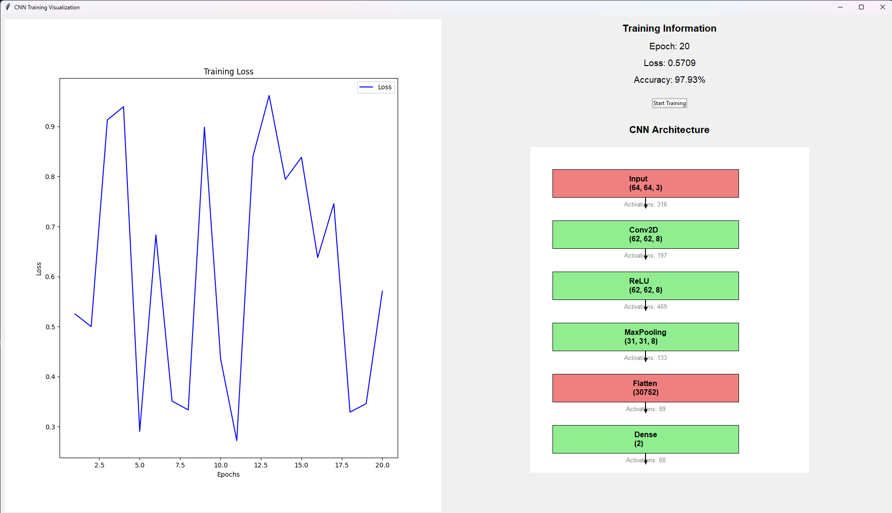

# UTPB-COSC-6389-Project3
# CNN Training Visualization with Custom Implementation

This project implements a Convolutional Neural Network (CNN) from scratch and provides a user-friendly graphical interface to visualize the training process and architecture. The CNN is designed for binary image classification tasks, such as distinguishing between cats and dogs.

## Features

- **Custom CNN Implementation**: A convolutional neural network built entirely from scratch without using machine learning libraries like TensorFlow or PyTorch.
- **Training Visualization**: Real-time plots of training loss and accuracy displayed during the training process.
- **CNN Architecture Visualization**: A graphical representation of the CNN architecture, including layers and their shapes.
- **Dynamic Updates**: Training progress, including epoch number, loss, and accuracy, dynamically updated in the GUI.
- **Image Loader**: Load and preprocess images for training, with support for binary classification (e.g., cats vs. dogs).

## CNN Architecture

The CNN implemented in this project consists of the following layers:
1. **Input Layer**: Accepts images of size `(64, 64, 3)`.
2. **Convolutional Layer**: Applies 8 filters of size `(3, 3)` with ReLU activation, resulting in an output shape of `(62, 62, 8)`.
3. **Flatten Layer**: Flattens the output of the convolutional layer to a single vector of size `30752`.
4. **Fully Connected Layer**: Dense layer with 2 neurons for binary classification.
5. **Softmax Layer**: Outputs probabilities for the two classes.

## GUI Overview

### Layout
- **Training Plot**: A real-time plot of the training loss, located on the left side of the window.
- **Information Panel**: Displays the current epoch, loss, and accuracy during training, located on the right side.
- **CNN Architecture Visualization**: A visual representation of the CNN layers and shapes, also on the right side.

### Interactions
- **Start Training**: A button to initiate the training process.
- **Dynamic Updates**: The GUI updates in real-time as the training progresses, showing changes in loss, accuracy, and epoch count.



## How to Run

1. **Prerequisites**:
   - Python 3.8 or higher
   - Required libraries: `numpy`, `tkinter`, `Pillow`, `matplotlib`

   Install dependencies using:
   ```bash
   pip install numpy pillow matplotlib

2. **UI Operation**:
  - Click the "Start Training" button to begin training the CNN.
  - Monitor the training progress and visualize the CNN architecture.

### Future Enhancements
    - Add support for validation data and metrics.
    - Extend to multi-class classification.
    - Implement additional CNN layers such as pooling and dropout.
    - Add a "Pause" and "Resume" functionality for training.